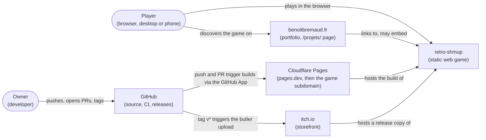
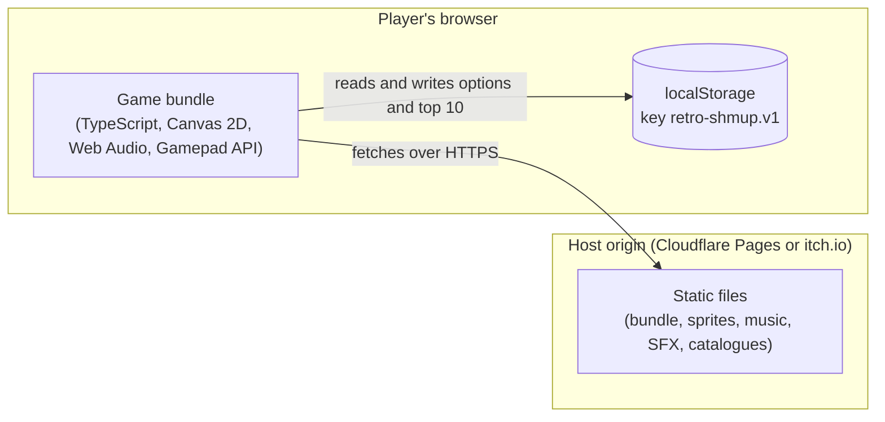

# Architecture — overview

The architecture documentation of retro-shmup follows **arc42** for its structure and the
**C4 model** for its zoom levels; decisions are ADRs under [`docs/decisions/`](../decisions/), the
design contract is the [GDD](../design/game-design-document.md). The UML study under
[`diagrams/`](diagrams/) is the contract the code must satisfy (CLAUDE.md, "Design before code").

## 1. Context and delivery (C4 level 1)

Who uses the game and which external systems build, host or distribute it. At run time the game
only fetches **its own static files from its origin**; it calls no other service (ADR-0006).

## 2. Containers (C4 level 2)

Everything executes in the player's browser; the static files come from the host's origin.

| Container | Technology | Responsibility | Decision |
|---|---|---|---|
| Game bundle | TypeScript strict, Vite, Canvas 2D, Web Audio, Gamepad API | Simulation, rendering, audio, input, screens | ADR-0001, 0002, 0003 |
| Static files | JS bundle, PNG sprite sheets, audio files, JSON catalogues | Code and content, assets credited per ADR-0005 | ADR-0004, 0005, 0008 |
| localStorage | Browser key-value store, per origin | Options and local top 10, nothing personal beyond initials | ADR-0006 |

## 3. UML study — index

Status: complete for 1.0 (2026-10-08).

| Folder | Diagram | Question it answers |
|---|---|---|
| `system` | [01 use case](diagrams/system/01-use-case.md) | Who wants what? 7 use cases with Cockburn specifications |
| `system` | [03 component](diagrams/system/03-component.md) | Where are the domain / adapters / app boundaries, and which ports cross them? |
| `gameplay` | [02 sequence — fixed-step tick](diagrams/gameplay/02-sequence-fixed-step-tick.md) | What happens during one frame? |
| `gameplay` | [02 sequence — enemy destroyed](diagrams/gameplay/02-sequence-enemy-destroyed.md) | Hit → destruction → drop → score, audio, HUD, without coupling |
| `gameplay` | [02 sequence — player hit](diagrams/gameplay/02-sequence-player-hit.md) | Shield or death, with every conditional branch |
| `gameplay` | [04 class — domain](diagrams/gameplay/04-class-domain.md) | Entity composition, pools, event bus, difficulty profile |
| `gameplay` | [05 state — player](diagrams/gameplay/05-state-player.md) | Player lifecycle |
| `gameplay` | [05 state — boss](diagrams/gameplay/05-state-boss.md) | Boss phases and timer |
| `meta` | [05 state — scenes](diagrams/meta/05-state-scenes.md) | The screens of GDD §9.1 and their transitions |
| — | [traceability matrix](traceability-matrix.md) | Is every use case realized, and every class used? |

**Deliberately not drawn**, each covered elsewhere:

| Not drawn | Covered by |
|---|---|
| Class diagram of the ports | Signatures owned by ADR-0001, 0002, 0003, 0006, 0009, 0010, 0012, 0014 and 0015; the ports appear as interfaces in 03 component |
| Sequence — save high score | UC3's text (one write, one failure branch) |
| Data-flow diagram | ADR-0006 (three initials, browser only, nothing transmitted) |
| Sequence — options | UC5's text (plain read and write) |
| State machines of pickups and ordinary enemies | Trivial lifecycle: spawn, move, leave or die |
| Chain multiplier | A calculation rule, specified in GDD §8 and covered by unit tests |
| Deployment diagram | ADR-0004 and ADR-0008 |

Conventions: Mermaid by default; PlantUML (`.puml` source + committed `.svg`) for the use-case
and component diagrams, where strict UML 2.5 notation matters. File names
`NN-<type>[-<subject>].md`; every diagram title carries its UML frame tag (`uc`, `sd`, `cd`,
`cmp`, `stm`).
