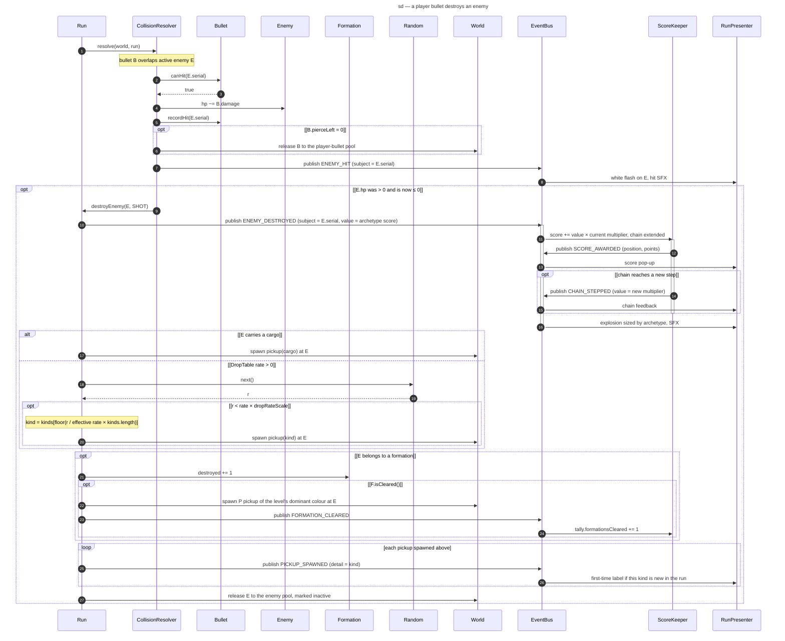

# Sequence diagram — gameplay — a player bullet destroys an enemy (1.0)

> **Source specs**: [Game Design Document](../../../design/game-design-document.md) v0.4 §4.3,
> §4.6, §5.2, §7.3, §8, §9.4
> **Related ADRs**: ADR-0002 (pools, seeded Random), ADR-0003 (Observer), ADR-0010 (bus per run,
> handler rules, `DropTable` as data)
> **Realizes**: UC1 steps 5–6 of [01-use-case](../system/01-use-case.md); classes of
> [04-class-domain](04-class-domain.md)

## Context

The most frequent collaboration of the game, inside the collision pass of one `Run.step`: a
player bullet meets an enemy, damages it, destroys it, maybe drops a pickup, maybe clears a
formation; the score, the effects and the sounds react without the entities knowing them. Bomb
kills enter at `destroyEnemy(E, BOMB)` and follow the same path. Enemy bullets and bodies hitting
the player are in `02-sequence-player-hit`; boss hits go through `damageBoss` and publish
`ENEMY_HIT` with the boss serial.

## Diagram

## Notes

- **Destroyed at most once**: the guard `[hp was > 0 and is now ≤ 0]` and the immediate release
  (inactive enemies are skipped by the rest of the pass, the pool release is safe during
  iteration) prevent a double score, a double roll and a double formation count when two bullets
  or a bomb and a bullet meet the same enemy in one step.
- **Spawning is a direct call, never a handler** (ADR-0010): pickups, the formation reward and
  the pool release happen in `Run.destroyEnemy`, in this fixed order; only `ScoreKeeper` changes
  state from a handler, and the presenter only reacts.
- **Subscription order**: `ScoreKeeper` first, `RunPresenter` second. `ScoreKeeper` publishes
  `SCORE_AWARDED` and `CHAIN_STEPPED` from its handler — other kinds than the one it handles, so
  the reused event objects stay valid (ADR-0010 invariants).
- **Chain rule** (GDD v0.4 §8): the kill is scored at the current multiplier, then the chain
  steps up; the chain timer restarts on every kill.
- **Random draws**: one draw per destroyed enemy whose `DropTable` rate is above 0 and that has no
  cargo; the same `r` picks the kind; draws happen in collision-pass order, so a replay
  reproduces every drop. Pickup sway is a pure function of the pickup's age — no draw.
- **Piercing**: `canHit` / `recordHit` use serials, so a bullet never hits the same body twice
  and a recycled pool enemy is not mistaken for the old one.
- **First-time labels** cover every spawn path (drop, cargo, formation reward), including the
  very first formation of level 1 (GDD §7.3).
