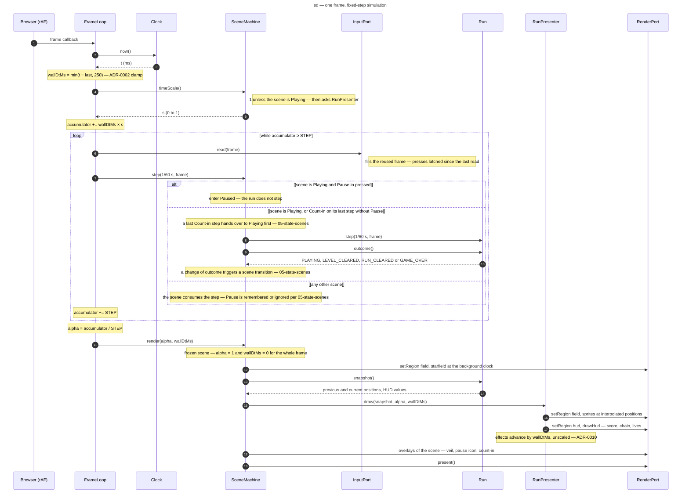

# Sequence diagram — gameplay — one frame, fixed-step simulation (1.0)

> **Source specs**: [Game Design Document](../../../design/game-design-document.md) v0.4 §9.1,
> §9.4, §13
> **Related ADRs**: ADR-0002 (fixed timestep, clamp, interpolation), ADR-0009 (intent frame,
> press latching), ADR-0010 (time scale, wall-clock effects), ADR-0014 (step units)
> **Realizes**: UC1 steps 5–8 and UC2 of [01-use-case](../system/01-use-case.md); components
> of [03-component](../system/03-component.md)

## Context

What happens during **one browser frame** while a run is on screen: how wall time becomes a
whole number of fixed simulation steps, where input is read, where the pause is decided, and how
the frame is drawn with interpolation. It is the loop where determinism is won or lost. Inside
`Run.step` see the fixed order in [04-class-domain](04-class-domain.md) and the two other
sequences. The loop counts wall time in milliseconds (`STEP = 1000 / 60` ms); the domain receives
`dt` in seconds, `1 / 60` (ADR-0014).

## Diagram

## Notes

- **Determinism**: the run only sees `step(1/60 s, frame)`; the number of steps per frame varies
  with the display rate and the time scale, never their length (ADR-0002).
- **The pause is decided before the run steps**, in the step that carries `Pause`, and only in
  `Playing`; the other scenes apply their own rule (05-state-scenes). Returning from a hidden tab,
  the clamp bounds the catch-up to 250 ms, consumed by the Paused scene.
- **The scene machine draws the frame**: it draws the starfield from its background
  clock, counted in steps of the scrolling scenes (05-state-scenes), passes the run's snapshot to
  `RunPresenter.draw(snapshot, alpha)`, then the HUD region. In the first playable it draws the
  empty HUD bands itself; the HUD contents move into `RunPresenter` with scoring and are drawn
  after the bands. The presenter takes `wallDtMs` when its first wall-clock effect lands.
- **Frozen scenes draw at `alpha = 1`**: `Paused`, `Count-in` and `Game over` take every step
  without stepping the run, while the loop keeps computing `alpha`; `SceneMachine.render` picks
  `alpha = 1` once for the whole frame, starfield and snapshot, so the frozen picture never
  wobbles, and hands the presenter `wallDtMs = 0`, so effects freeze too.
- **One input read per step**: a press is consumed by exactly one step even when a frame runs
  several, and a tap shorter than a step is not lost (latched by the adapter).
- **Time effects never touch the run**: during hit-stop `s` falls to 0 and the loop takes no
  step; the presenter keeps animating on unscaled `wallDtMs`, and the effect ends on wall time
  (ADR-0010). Outside `Playing` the scale is 1, so a slow motion never spills into the results
  or the pause. The boss timer and the chain window, counted in steps, are untouched.
- **Rendering reads, never writes**: the presenter uses the snapshot and its HUD getters;
  nothing on the render path changes simulation state.
- Outside a run (menus) the same loop runs; `SceneMachine` draws its screen instead of delegating.
