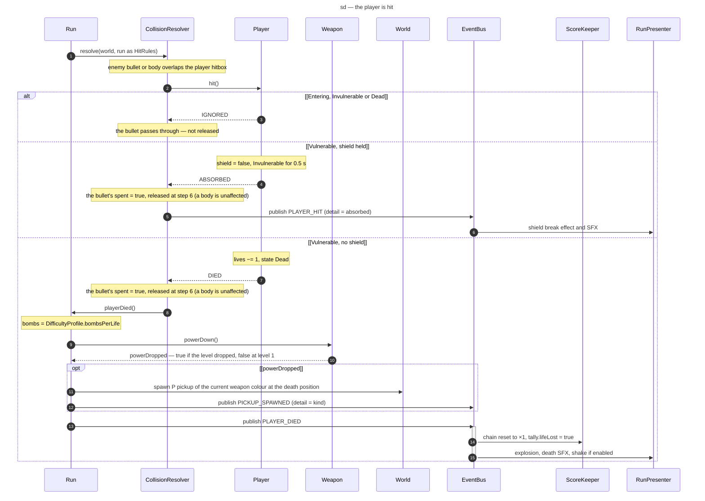

# Sequence diagram — gameplay — the player is hit (1.0)

> **Source specs**: [Game Design Document](../../../design/game-design-document.md) v0.4 §4.1,
> §4.4, §4.6, §5.2, §8
> **Related ADRs**: ADR-0002 (pools), ADR-0010 (bus per run, handler rules)
> **Realizes**: UC1 extensions 5b, 5c and 5c1 of [01-use-case](../system/01-use-case.md);
> lifecycle in [05-state-player](05-state-player.md)

## Context

What happens when an enemy bullet or an enemy or boss body overlaps the player's 4 × 4 hitbox,
with every branch of GDD §4.4: ignored, absorbed by a shield charge, or a life lost with the
power penalty and its release. The timing — invulnerability, respawn, Game over at the end of
the death sequence — belongs to the player's state machine.

## Diagram

## Notes

- **At most one non-ignored outcome per step**: once the ship is `Dead` every further hit in the
  same step — a second bullet, a body — returns `IGNORED`, so two lives can never be lost at once.
- **Invulnerable means untouchable** (GDD v0.4 §4.1): bullets and bodies pass through an
  entering, invulnerable or dead ship; only a hit that counts consumes the bullet.
- **Game over is not decided here**: the hit always returns `DIED`; when the death sequence ends,
  `05-state-player` either respawns the ship or, with no life left, sets the run outcome to
  `GAME_OVER` (GDD v0.4 §4.4 — the last explosion plays out).
- **The player decides the outcome, the run applies the penalties**: `Player.hit()` returns
  `IGNORED`, `ABSORBED` or `DIED`; `Run.playerDied()` applies what needs the difficulty profile
  and the world — bombs, power, release.
- **No release at power 1** (GDD v0.2 §4.4): `powerDown()` returns `false` and nothing spawns.
- **Order**: the release pickup spawns before `PLAYER_DIED` is published, so every listener sees
  a consistent world; `ScoreKeeper` resets the chain before the presenter reacts.
- **Bombs reset to the difficulty value** (`bombsPerLife`, GDD §10), not to a literal.
