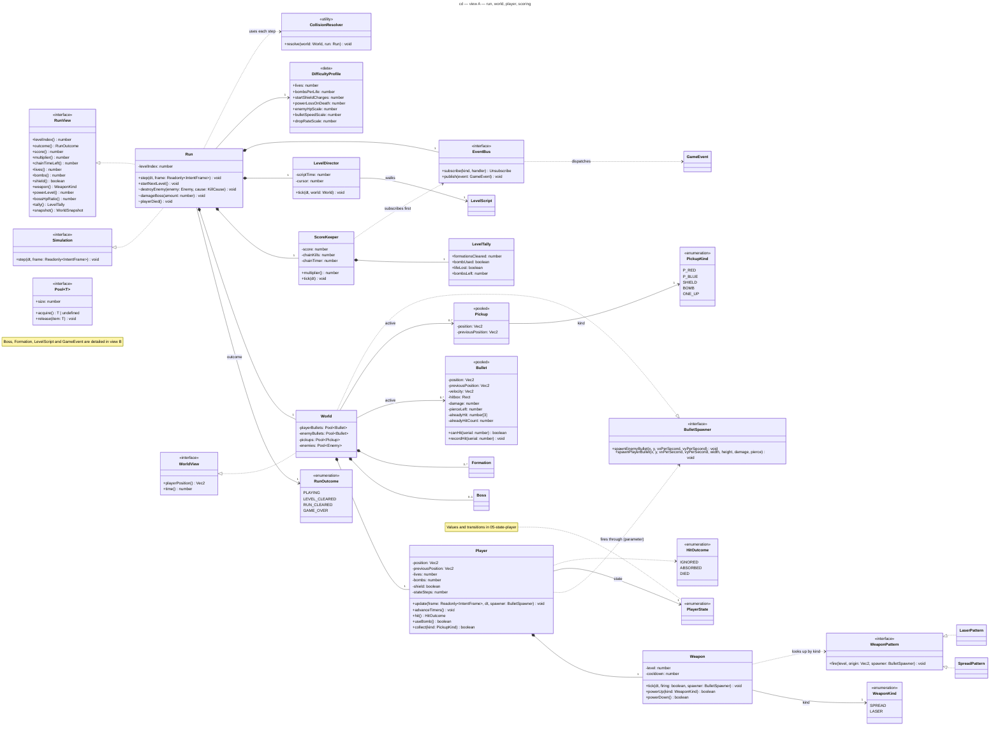
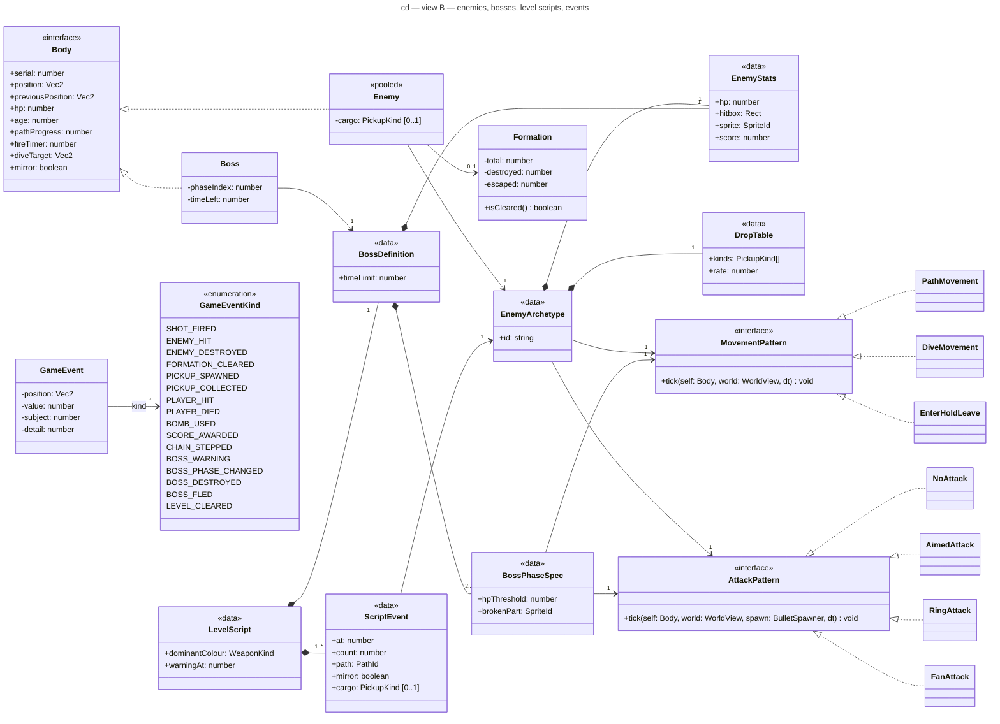

# Class diagram — gameplay — domain model of a run (1.0)

> **Source specs**: [Game Design Document](../../../design/game-design-document.md) v0.5 §4–§8, §10
> **Related ADRs**: ADR-0002 (Simulation, Random, Pool), ADR-0003 (composition, patterns),
> ADR-0009 (IntentFrame), ADR-0010 (event bus per run, `DropTable` as data,
> presentation outside the outcome)
> **Realizes**: UC1 of [01-use-case](../system/01-use-case.md); the structure is placed in
> [03-component](../system/03-component.md) (`Run` component)

## Context

The types of the `Run` component: everything that decides the **outcome** of a run, nothing
that only presents it (`RunPresenter`, ADR-0010). Two views of one model:

- **A — run, world, player, scoring**: who owns what during a run, how rules are applied;
- **B — enemies, bosses, level scripts, events**: how enemies are composed from data and
  stateless strategies, and what the run tells its listeners.

Port signatures are owned by their ADRs and are not repeated. The scene machine is in
`meta/05-state-scenes`; the player's and the boss's lifecycles in `gameplay/05-state-*`.
Attributes shown are the ones the GDD rules need, not an exhaustive field list.

**Stereotype legend**: «interface» and «enumeration» are standard UML; «data» marks an
immutable record loaded from the level scripts (shared by every instance using it); «pooled»
marks a class whose instances come from a `Pool<T>` (ADR-0002) and are recycled, never
allocated in the loop; «utility» marks a stateless function module.

## Diagram A — run, world, player, scoring

## Diagram B — enemies, bosses, level scripts, events

## How each GDD rule is carried

| Rule (GDD v0.4–v0.5) | Where it lives |
|---|---|
| Two weapons × 5 levels, Spread first, switch keeps the level (§4.3) | `Weapon.powerUp(kind)`; `kind` selects the stateless `WeaponPattern`; `cooldown` carries the rate |
| Laser width and piercing (§4.3) | fast player bullets with `hitbox`, `pierceLeft`, and `alreadyHit` — the **serials** of the bodies already hit, enemies and boss alike — so one body is hit once per bullet, even when a pooled enemy is reused or the bullet overlaps a large boss for several steps |
| One hit = one life, shield charge, invulnerability (§4.4) | `Player.hit(): HitOutcome` — `IGNORED` while entering, invulnerable or dead (the bullet passes through), `ABSORBED` by the shield, `DIED` otherwise; Game over is decided when the death sequence ends (`05-state-player`) |
| Next level, run cleared (§2, §7) | `Run.startNextLevel()` resets the outcome, the tally and the level script, reseeds `Random` from the run seed and the level index; the outcome is `LEVEL_CLEARED` after levels 1–2, `RUN_CLEARED` after level 3 |
| Death: −1 level and release, none at level 1 (§4.4) | `Weapon.powerDown(): boolean`; `Run.playerDied()` resets the bombs to `DifficultyProfile.bombsPerLife`, calls `powerDown()` and spawns the release pickup when it returns `true` |
| Bombs per life, cap, empty stock, hit the boss (§4.5) | `Player.useBomb(): boolean`; the run cancels `enemyBullets` and damages enemies and boss |
| Pickup at its cap → 1 000 points (§4.6) | `Player.collect(kind): boolean` = applied; `PICKUP_COLLECTED` carries the kind in `detail` and "applied" in `value`; `ScoreKeeper` adds 1 000 when not applied |
| Pickup collection box 32 × 32, player hitbox 4 × 4 (§4.1, §4.6) | `CollisionResolver` tests pickups against the full sprite box and bullets / bodies against the hitbox |
| First-time pickup labels (§7.3) | `PICKUP_SPAWNED` carries the kind in `detail`; `RunPresenter` remembers which kinds it has labelled this run (presentation only, ADR-0010) |
| Contact hits the player (§5.2) | `CollisionResolver`: player hitbox (4 × 4) against enemy and boss hitboxes |
| Roles as data lines (§5.2, §5.3) | `EnemyArchetype` = `EnemyStats` + `DropTable` + one movement + one attack |
| Carrier cargo set by the script (§5.2) | `ScriptEvent.cargo` → `Enemy.cargo`, which overrides the `DropTable` roll (ADR-0010) |
| Formation guarantee, bomb kills count (§5.2) | `Formation` counts destroyed and escaped; one `Run.destroyEnemy(enemy, cause)` path for shots and bombs updates `Enemy.formation`; the boss has its own `Run.damageBoss` path (no formation) |
| Boss phases, timer, flee, broken parts (§6) | `Boss.phaseIndex`, `timeLeft`; `BossPhaseSpec.hpThreshold`, `brokenPart`; lifecycle in `05-state-boss` |
| Boss bonus 10 000 + 100 × seconds left (§6) | `BOSS_DESTROYED` carries the seconds left in `value`; `ScoreKeeper` scores it |
| Deterministic script, WARNING, boss entry (§6, §7.1) | `LevelDirector` walks `LevelScript.events` by `scriptTime`; publishes `BOSS_WARNING` at `warningAt` |
| Chain: 2 s window, step every 5 kills, ×8 cap, reset on death (§8) | `ScoreKeeper.chainKills`, `chainTimer`, `multiplier()` |
| Tally: full formations, no bomb, no miss, bombs left (§8) | `LevelTally`, reset at each level; on `LEVEL_CLEARED` `ScoreKeeper` adds the bonuses; `RunView.tally()` feeds the results screen |
| Bomb used (§4.5, §8) | `BOMB_USED` → `ScoreKeeper` sets `tally.bombUsed` (no-bomb bonus lost) |
| Chain expiry (§8) | `ScoreKeeper.tick(dt)` counts down `chainTimer` in every step and breaks the chain at 0 |
| Difficulty knobs (§10) | `DifficultyProfile`; the HUD caps (9 lives, 5 bombs, level 5) are constants, not knobs |
| Clamp to the field, fly-in (v0.5 §4.1) | `Player.update`: clamp applied once `Entering` ends; fly-in path in 05-state-player |
| Spread level 1 (v0.5 §4.3) | `SpreadPattern` at level 1 spawns one bullet from the nose (size, speed, rate: GDD §4.3); `Weapon.cooldown` in whole steps; bullets released once fully above the field |

## Notes

- **Composition, not inheritance** (ADR-0003): the only generalizations are interface
  realizations. `Body` is the movable, damageable state shared by `Enemy` and `Boss`, so the same
  stateless strategies drive both. GDD §5.2 roles as data lines: Popcorn = `PathMovement` + `NoAttack` (the leader
  of some formations uses `AimedAttack` with a single volley); Diver = `DiveMovement` +
  `NoAttack`; Gunner = `EnterHoldLeave` + `AimedAttack` + drop {P, 30 %}; Carrier = `PathMovement`
  (a straight crossing) + `NoAttack` + cargo; Heavy = `EnterHoldLeave` (long hold) + `RingAttack`
  or `FanAttack` + drop {Bomb or Shield, 60 %}.
- **Strategies are stateless**; per-enemy scratch state (path progress, fire timer, dive target)
  lives on `Body`, so archetypes are shared data and nothing is allocated per spawn. Boss phases
  are data that swap the strategies — this is how ADR-0003's "BossPhase" State is realized.
- **One owner per object**: `Run` owns `World`, `World` owns `Player` and the pools; active
  bullets, pickups and enemies are references into the pools, kept in preallocated lists.
- **Firing**: `World` passes itself, as the `BulletSpawner`, to `Player.update` each step, which
  forwards it to `Weapon.tick` — the same parameter style as `AttackPattern.tick`; no object
  stores the spawner. `BulletSpawner` is declared with the weapon code, which avoids an import
  cycle between player and world.
- **Player timers**: `Run.step` calls `Player.update` at step 2 and `Player.advanceTimers` at
  step 7, so a state change (end of the fly-in or of the invulnerability) applies from the next
  step, after the collisions of step 5.
- **Units**: timers and cooldowns are whole numbers of steps, counted down by 1 each step, and
  converted from the GDD's seconds once, at load (counted in steps: ADR-0002); velocities are pixels per second,
  multiplied by `dt` in seconds (ADR-0014). The domain never counts time by subtracting `dt`.
- **Active lists**: removal while iterating is backwards, swap-with-last, then `pool.release` —
  the only place either list changes. The player-bullet pool holds 16 bullets *(initial)*; a request on an empty pool is dropped (ADR-0002).
- **Weapon strategy**: while `SpreadPattern` is the only pattern, `Weapon` calls it directly; the
  look-up by `WeaponKind` comes with the second pattern. Per-level values live in a data record
  (ADR-0003).
- **Events**: one reusable `GameEvent` object per kind (ADR-0010) — handlers never keep it and
  never publish an event of the kind they handle; `subject` is the serial of the body concerned
  (white flash, explosion size). `ScoreKeeper` subscribes first and is the only handler allowed
  to change state. Spawns (death release, formation P,
  cargo) are direct calls inside `Run.step`, never handlers.
- **Interpolation**: every moving object keeps `previousPosition`; `RunView.snapshot()` exposes
  previous and current positions so `RunPresenter` interpolates with `alpha` (ADR-0002) without
  allocating.
- **Fixed order of `Run.step`** — the determinism contract (ADR-0002): (1) `LevelDirector.tick`
  spawns due events; (2) the player moves and its `Weapon` fires; (3) a pressed bomb is applied;
  (4) enemies, boss and bullets move, their strategies act; (5) `CollisionResolver` runs (bullets
  vs enemies and boss, then hazards vs player, then pickups vs player); (6) bodies leaving the
  screen are released, formations count escapes; (7) `ScoreKeeper.tick` and the boss and player
  timers advance; (8) the outcome is updated — a level end is deferred while the player is `Dead`,
  and a final death (no life left) sets `GAME_OVER`, which wins over a pending level end.
- **HUD data**: `RunView` exposes everything the HUD shows (GDD §9.2), read by `RunPresenter`
  each frame without allocation.
- **`destroyEnemy` and `damageBoss` have package visibility** (`~`): `CollisionResolver` and the bomb path of `Run`
  share it; it is not part of the run's public contract.
- **Not modelled**: geometric helpers (`Vec2`, `Rect`), ids (`SpriteId`, `PathId`), `KillCause`
  (shot or bomb), `WorldSnapshot` (the read-only view returned to the presenter).
