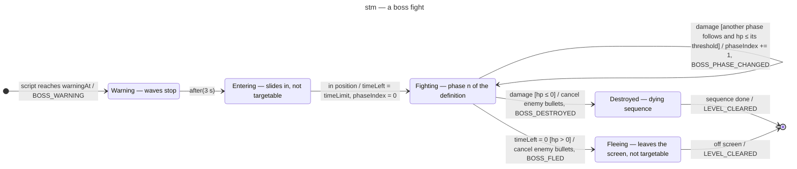

# State machine diagram — gameplay — a boss fight (1.0)

> **Source specs**: [Game Design Document](../../../design/game-design-document.md) v0.4 §3.3,
> §4.5, §6, §8
> **Related ADRs**: ADR-0003 (boss phases as data), ADR-0010 (outcome vs presentation)
> **Realizes**: UC1 steps 7–8 and extension 8a of [01-use-case](../system/01-use-case.md);
> `Boss`, `BossDefinition`, `BossPhaseSpec` of [04-class-domain](04-class-domain.md)

## Context

The lifecycle of one boss, from the warning to its destruction or its escape. Phases are data:
a `BossDefinition` holds 2 or 3 `BossPhaseSpec` (level 3 has 3), each with its HP threshold, its
movement and attack strategies and the part that breaks off. Timers count simulation steps.
Notation: `trigger [guard] / effect`.

## Diagram

## Notes

- **Phases are one data-driven state**: the self-transition repeats while the guard holds, so a
  single large hit (a bomb) that crosses two thresholds advances two phases in the same step,
  publishes one `BOSS_PHASE_CHANGED` per crossed threshold and breaks every part.
- **Targetable only in `Fighting`**: bullets pass through the boss while it enters or flees; hits
  and bomb damage apply only in a phase (GDD §4.5: bombs damage the boss). Its body hits the
  player while it enters and fights (GDD v0.3 §5.2); in `Destroyed` and `Fleeing` it is harmless,
  so nothing can kill the player during the end of the fight (GDD v0.4 §6).
- **The 90 s timer runs only in `Fighting`**, is frozen by the pause and counts steps, so hit-stop
  and slow motion never change it (ADR-0010). If HP and timer reach 0 in the same step, the
  destruction wins.
- **End of the fight** (GDD v0.4 §6): enemy bullets are cancelled on both endings, so the player
  cannot die during the sequence.
- **Score and outcome**: `BOSS_DESTROYED` carries the seconds left; `ScoreKeeper` adds 10 000 +
  100 × seconds (GDD §6), `BOSS_FLED` scores nothing. `LEVEL_CLEARED` is published by `Run` when
  the sequence ends; `ScoreKeeper` then adds the level tally (GDD §8) and the run outcome becomes
  `LEVEL_CLEARED`, or `RUN_CLEARED` after level 3.
- **Slow motion on boss death** is presentation (`RunPresenter`) reacting to `BOSS_DESTROYED`; it
  never changes the length of the dying sequence in steps.
