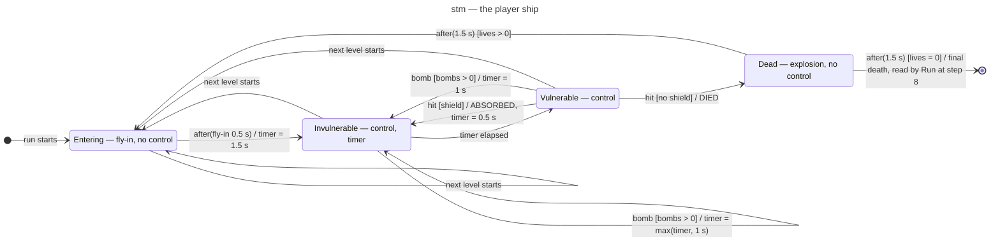

# State machine diagram — gameplay — the player ship (1.0)

> **Source specs**: [Game Design Document](../../../design/game-design-document.md) v0.5 §4.1,
> §4.4, §4.5
> **Related ADRs**: ADR-0002 (timers counted in simulation steps)
> **Realizes**: the `PlayerState` of [04-class-domain](04-class-domain.md); the timing side of
> [02-sequence-player-hit](02-sequence-player-hit.md)

## Context

The lifecycle of the player's ship within one run: when it can be hit, when it can act, and how
a life and the run end. The `Player` object lives as long as the `Run`; levels do not recreate
it. Durations are GDD *(initial)* values counted in simulation steps, so they are deterministic
and frozen by the pause. Notation: `trigger [guard] / effect`; `after(d)` is a time trigger.

## Diagram

## Notes

- **The 2 s of respawn invulnerability** (GDD §4.1) are split: the fly-in without control, then
  `Invulnerable` with control. The same entry runs at the start of every level (GDD v0.4 §4.1).
- **One timer**: `stateSteps` counts down by 1 each step in every timed state (`Entering`,
  `Invulnerable`, `Dead`); durations come from GDD §4.1 converted to whole steps once, at load
  (ADR-0002: the simulation sees `dt` and a step counter). `max(timer, 1 s)` on a bomb applies to
  it.
- **Fly-in** (positions: GDD v0.5 §4.1): linear, from the start point to the resting point over
  the `Entering` steps; no fire and no clamp to the field while `Entering`. Both positions are set
  together at the start, so the interpolation never draws a smear (ADR-0002). The weapon's
  cooldown is 0 when `Entering` ends, so the first shot is immediate.
- **Blink** (rate and phase: GDD v0.5 §4.1) while `Entering` or `Invulnerable`: the phase comes
  from a continuous count of steps since the protection began (fly-in, or invulnerability entered
  from `Vulnerable`). `Entering --> Invulnerable` and a bomb's `max(timer, 1 s)` keep the count;
  `stateSteps` is not used for it, since it restarts. The `Player` exposes the count in the
  snapshot; the presenter derives the blink from it, not from wall time, so it freezes with the
  pause and stays deterministic (ADR-0010).
- **Hits are ignored** in `Entering`, `Invulnerable` and `Dead` (`HitOutcome.IGNORED`): bullets and
  bodies pass through. In `Dead` this guarantees at most one life lost per step.
- **Bombs** work in `Vulnerable` and `Invulnerable` only; they never shorten an ongoing
  invulnerability (`max`). With an empty stock the input does nothing.
- **A life is lost on the transition to `Dead`**: lives −1, bombs reset to `bombsPerLife`, power
  −1 with its release (none at level 1), chain reset — see the sequence diagram.
- **Game over after the explosion** (GDD v0.4 §4.4): the `Player` holds no reference to the run;
  when the death sequence ends with no life left, `Run` reads it at step 8 of `Run.step` and sets
  the outcome to `GAME_OVER`; the scene machine then shows Game over.
- **Dying while the boss ends**: the player's last shots can destroy the boss (or its timer can
  run out) while the ship is `Dead`. The level end is then **deferred** until the death sequence
  ends: with lives left the level ends normally and the next level starts at `Entering`; with no
  life left `GAME_OVER` wins (04-class-domain, step 8). A death can no longer start during the
  boss's own sequence, since enemy bullets are cancelled (GDD v0.4 §6).
- **Pause** freezes every timer: the run is not stepped while paused (02-sequence-fixed-step-tick).
