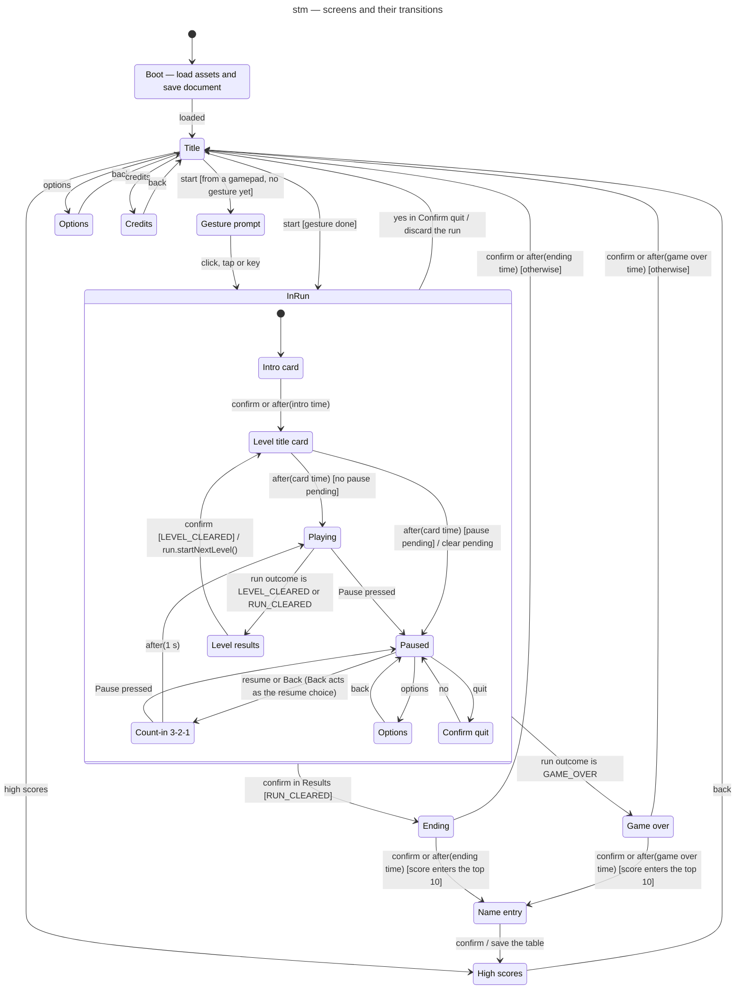

# State machine diagram — meta — screens and their transitions (1.0)

> **Source specs**: [Game Design Document](../../../design/game-design-document.md) v0.5 §3.4,
> §4.2, §9.1, §9.3
> **Related ADRs**: ADR-0006 (save document), ADR-0009 (gestures, automatic pause), ADR-0010
> (one run, one bus), ADR-0015 (pause in the first playable)
> **Realizes**: UC1–UC7 of [01-use-case](../system/01-use-case.md) at the screen level; the
> `SceneMachine` component of [03-component](../system/03-component.md)

## Context

Every screen of the game and what moves between them — the `SceneMachine`. It owns the active
`Run` while one exists, reads its outcome after each step, and is the only place where the
pause is decided (02-sequence-fixed-step-tick). Notation: `trigger [guard] / effect`.

## Diagram

## Notes

- **`InRun` entry creates the run** (`entry / new Run`, with its own event bus and `RunPresenter`);
  the run is released when `Title` is next entered (from `Confirm quit`, `Game over` or `Name
  entry`). `Game over`, `Ending` and `Name entry` keep the finished run read-only (`RunView`),
  never step it, and read its snapshot and score. A new run never inherits listeners of the
  previous one (ADR-0010).
- **Edges leaving `InRun` start from one substate**: Mermaid draws them from the composite
  boundary, so the label names the substate (`yes in Confirm quit`, `confirm in Results`); `Game
  over` is reached from `Playing`, when the run's outcome becomes `GAME_OVER` at the end of the
  death sequence (05-state-player).
- **Pause rules** (GDD v0.4 §9.1, ADR-0009):
  - in `Playing`, only `Pause` enters `Paused`, before the run steps; `Back` is ignored in play, so
    the gamepad `B` (bomb and back) never pauses. The keyboard `Esc` sets both `Pause` and `Back`:
    it pauses in play and resumes from the pause;
  - in `Paused`, `Pause` does nothing — automatic triggers can only enter the pause — and `Back`
    resumes like the menu choice;
  - in `Count-in`, `Pause` returns to `Paused`, so an automatic trigger never lets the game resume
    unfocused;
  - in a card or the results, `Pause` (player or automatic) sets a **pending pause** flag, applied
    when play starts and cleared when leaving `InRun`;
  - every other scene ignores `Pause`.
- **The time scale** returned to the loop is 1 in every scene except `Playing` (ADR-0010).
- **Options are two states sharing one screen implementation**, so `back` returns to the right
  parent without a history pseudostate.
- **Gesture prompt** exists only for a start from a gamepad before any click, tap or key press;
  the audio unlock itself happens in the input adapter's handler (ADR-0009).
- **Name entry** follows both Ending and Game over when the score qualifies (GDD v0.2 §9.1); a run
  quit from the pause never reaches it. High scores then show the new entry highlighted (UC3).

## First-playable subset (first playable brick)

The first playable build implements part of this machine; each later brick adds states until the
diagram above is complete. The game it ships is described by the GDD and the ADRs; this section
alone records the build order and the interim deviations of each brick.

- **States**: `Boot` → `Title` → `InRun { Playing }`. `Boot` loads nothing yet (no assets, no
  save document); the run's lifetime follows the notes above.
- **Start**: `Confirm` pressed (keyboard `Enter` in C1, gamepad `A` from C2), or a tap or click
  anywhere on the title (C2). `Pause` is ignored on the
  title, as in every scene other than play (pause rules above).
- **Interim deviation, cards**: `InRun [*] --> Playing` until the intro and level title cards
  land with the bitmap fonts and the message catalogue (screens brick), when it becomes
  `[*] --> IntroCard` again.
- **Interim deviation, gesture**: `Title --> InRun : start` has no `[gesture done]` guard until
  `Gesture prompt` lands with audio. That brick decides where the "a gesture happened" signal
  lives (the intent frame, or `AudioPort`, which owns the unlock), and makes a touch start count
  as a gesture on `pointerup` (ADR-0015 decision 8).
- **Interim deviation, pause** (first playable only): the input adapter already synthesizes
  `Pause` (ADR-0009, ADR-0015 decision 5), but `Playing` ignores it until `Paused` and `Count-in`
  land with the enemies brick. A test pins "`Playing` ignores `Pause`", so it fails, and the
  deviation is removed on purpose, when `Paused` lands.

### Enemies brick additions

The enemies brick adds `Paused`, `Count-in` and `Game over`, and removes the pause deviation above.

- **Paused** follows the pause rules above: `Pause` in `Playing` enters it before the run steps;
  `Confirm` or `Back` starts `Count-in`; `Pause` in `Count-in` returns to `Paused`. **Interim
  deviation, pause menu**: the menu's options, quit and confirm-quit choices need text and arrive
  with the screens brick; until then `Paused` offers resume only. It draws the frozen field
  under a dim veil and a two-bar pause icon made of rectangles.
- **Count-in** shows a 3-2-1 with the HUD digits, centred on the field, for 1 s (GDD §9.1), the
  run still frozen. On its last step it hands over to `Playing` and the run steps in that
  same step, so the first resumed frame interpolates forward from the frozen picture, never back.
- **Game over**: `InRun --> GameOver` when the outcome is `GAME_OVER`. **Interim deviation,
  name entry**: `GameOver --> Title` on `Confirm` or after the game-over time (GDD §4.4), with no
  `NameEntry` branch until the high scores exist (screens brick). It draws the frozen field of
  the finished run, kept read-only (notes above), under a dim veil, without text.
- **Frozen scenes** (`Paused`, `Count-in`, `Game over`) take every step without stepping the run
  and do not advance the background clock. `SceneMachine.render` picks the frame's alpha once:
  `alpha = 1` for the whole frame, starfield and snapshot, so nothing wobbles between two
  positions (02-sequence-fixed-step-tick); and it hands the presenter `wallDtMs = 0`, so effects
  freeze too.
- **Scene traits**: what differs between scenes for drawing and timing (`frozen`, `scrolls`,
  `drawsRun`) is one data table, `SCENE_TRAITS`, read by `step`, `render` and `timeScale`; each
  scene keeps one private method for its transitions. The veil, the pause icon and the 3-2-1 are
  pure draw functions of the presentation module, never drawn by the navigator (ADR-0010).
  Scene objects (State pattern, ADR-0003) wait until the screens brick brings the machine to
  about ten states. Count-in and game-over times live in `SceneTuning` (`tuning.ts`).
- **Interim deviation, level script**: the level script holds the rows of GDD §7.2.1 and its time
  wraps to 0 at 45 s, the slot of the absent Heavy (`LevelScript.loopAt`); enemies of the previous
  pass stay alive. It loops until the level brick adds the rest of level 1, the warning and the
  boss: no `LEVEL_CLEARED`, no `BossDefinition` and no `warningAt` before then.
- **Interim deviation, drops and formations**: no `DropTable` roll, no full-formation P, no
  `Formation` count, no death release of the weapon and no bombs until the pickups and rules
  brick, so `Run` holds no `Random` yet and the determinism test compares (script, inputs) only.
  The brick builds `PathMovement`, `DiveMovement`, `EnterHoldLeave`, `NoAttack` and
  `AimedAttack`; `RingAttack` and `FanAttack` wait for the Heavy; only the event kinds the brick
  publishes are added.

### Presentation of the first playable

- **Title**: the starfield in the field and empty HUD bands; no ship, no text (fonts arrive with
  the screens brick).
- **Playing**: the starfield, the ship and its bullets as rectangles in palette colours (no
  sprite before the assets brick), empty HUD bands; the ship flies in from below (GDD §4.1).
- **Background clock**: the scene machine counts the starfield's scroll time in steps of the
  scenes that scroll (Title, Playing), so the starfield is continuous across the start and
  freezes with hit-stop and in the frozen scenes (enemies brick additions).
- **Interim deviation, blink**: the blink is always on; its non-flashing replacement and its
  reduced-motion default (GDD §9.3, §9.7) arrive with the options screen (screens brick).
- **Enemies brick**: enemies and enemy bullets are rectangles in palette colours that differ
  from the ship's hull colour (the smoke-test oracle); `RunPresenter` picks the colour from the
  archetype id or size tier, never from archetype data (ADR-0010). The left HUD band shows the
  score, the multiplier, the chain bar and the reserve lives (GDD §9.2), top to bottom, with
  margins of at least 8 px; their positions are one record in `presentation/hud-layout.ts`
  (landscape only until C2) drawn by a `drawHud` function that `RunPresenter` calls. Digits are
  drawn by the renderer until the bitmap fonts of the screens brick: a font draws only its glyph
  set and throws on any other character, `hud` being `0-9` and `×` (the `RenderPort` contract).
  Numbers are drawn digit by digit (`% 10`, one `drawText` per digit from a constant table of
  one-character strings), with no cache and no formatting, so drawing the HUD never allocates.
- **Smoke test** (the single browser test, ADR-0003): Chromium only, against the built bundle.
  The ship's palette colour is absent at its resting point on the title, then present there after
  `Enter` and at least 30 frames. The logic time per step is measured and logged against the
  4 ms budget (ADR-0002 decision 7), not asserted.

### Build order

| Brick | Delivers |
|---|---|
| C1 — first playable on keyboard | the subset above; `Player`, `PlayerState`, `Weapon` with Spread level 1, player bullets; `RunPresenter`; `DeviceInput` with its façade and the `keyboard` module; ADR-0015 decisions 4 (keyboard part), 5 (lost focus), 6 and 9; the smoke test |
| D — enemies | Popcorn, Diver, Gunner as archetype data and stateless strategies; `LevelDirector` with the looping rows of GDD §7.2.1; `ActiveList` for player bullets, enemy bullets and enemies; `CollisionResolver` with `HitRules`; lives, `hit()`, `Dead` and respawn; `EventBus` with `ScoreKeeper` (points and chain); `RunOutcome.GAME_OVER`; `Paused`, `Count-in`, `Game over`; HUD digits, chain bar and life icons; hit flash and small explosion behind effect switches; an ESLint rule keeping `src/domain/game` from importing `presentation` and `scenes`; the `RenderPort` glyph-set contract |
| C2 — the other devices | ADR-0015 decisions 1–3 (portrait screen, `layout()`, the portrait HUD layout), the `pointer` and `gamepad` modules and the arbitration function (decisions 4, 5, 7, 8); start by `A`, tap or click; the touch pause button |
| Later bricks | touch bomb button with the bomb effect (pickups and rules brick); until then the second-finger tap is the only touch bomb |
