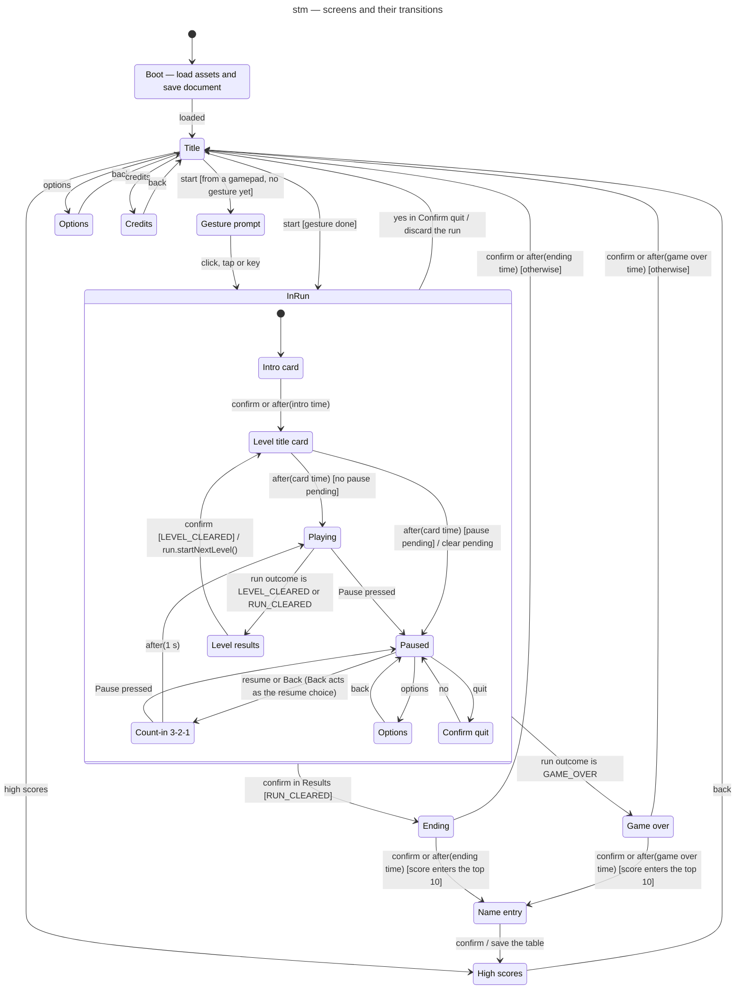

# State machine diagram — meta — screens and their transitions (1.0)

> **Source specs**: [Game Design Document](../../../design/game-design-document.md) v0.5 §3.4,
> §4.2, §9.1, §9.3
> **Related ADRs**: ADR-0006 (save document), ADR-0009 (gestures, automatic pause), ADR-0010
> (one run, one bus), ADR-0015 (pause in the first playable)
> **Realizes**: UC1–UC7 of [01-use-case](../system/01-use-case.md) at the screen level; the
> `SceneMachine` component of [03-component](../system/03-component.md)

## Context

Every screen of the game and what moves between them — the `SceneMachine`. It owns the active
`Run` while one exists, reads its outcome after each step, and is the only place where the
pause is decided (02-sequence-fixed-step-tick). Notation: `trigger [guard] / effect`.

## Diagram

## Notes

- **`InRun` entry creates the run, exit releases it** (`entry / new Run`, `exit / release Run`): a
  new run never inherits listeners of the previous one (ADR-0010).
- **Edges leaving `InRun` start from one substate**: Mermaid draws them from the composite
  boundary, so the label names the substate (`yes in Confirm quit`, `confirm in Results`); `Game
  over` is reached from `Playing`, when the run's outcome becomes `GAME_OVER` at the end of the
  death sequence (05-state-player).
- **Pause rules** (GDD v0.4 §9.1, ADR-0009):
  - in `Playing`, only `Pause` enters `Paused`, before the run steps; `Back` is ignored in play, so
    the gamepad `B` (bomb and back) never pauses. The keyboard `Esc` sets both `Pause` and `Back`:
    it pauses in play and resumes from the pause;
  - in `Paused`, `Pause` does nothing — automatic triggers can only enter the pause — and `Back`
    resumes like the menu choice;
  - in `Count-in`, `Pause` returns to `Paused`, so an automatic trigger never lets the game resume
    unfocused;
  - in a card or the results, `Pause` (player or automatic) sets a **pending pause** flag, applied
    when play starts and cleared when leaving `InRun`;
  - every other scene ignores `Pause`.
- **The time scale** returned to the loop is 1 in every scene except `Playing` (ADR-0010).
- **Options are two states sharing one screen implementation**, so `back` returns to the right
  parent without a history pseudostate.
- **Gesture prompt** exists only for a start from a gamepad before any click, tap or key press;
  the audio unlock itself happens in the input adapter's handler (ADR-0009).
- **Name entry** follows both Ending and Game over when the score qualifies (GDD v0.2 §9.1); a run
  quit from the pause never reaches it. High scores then show the new entry highlighted (UC3).

## First-playable subset (first playable brick)

The first playable build implements part of this machine; each later brick adds states until the
diagram above is complete. The game it ships is described by the GDD and the ADRs; this section
alone records the build order and three interim deviations: the run starts at `Playing`, the start
has no gesture guard, and `Playing` ignores `Pause`.

- **States**: `Boot` → `Title` → `InRun { Playing }`. `Boot` loads nothing yet (no assets, no
  save document); `InRun` entry creates the run and exit releases it, as above.
- **Start**: `Confirm` pressed (keyboard `Enter` in C1, gamepad `A` from C2), or a tap or click
  anywhere on the title (C2). `Pause` is ignored on the
  title, as in every scene other than play (pause rules above).
- **Interim deviation, cards**: `InRun [*] --> Playing` until the intro and level title cards
  land with the bitmap fonts and the message catalogue (screens brick), when it becomes
  `[*] --> IntroCard` again.
- **Interim deviation, gesture**: `Title --> InRun : start` has no `[gesture done]` guard until
  `Gesture prompt` lands with audio. That brick decides where the "a gesture happened" signal
  lives (the intent frame, or `AudioPort`, which owns the unlock), and makes a touch start count
  as a gesture on `pointerup` (ADR-0015 decision 8).
- **Interim deviation, pause**: the input adapter already synthesizes `Pause` (ADR-0009,
  ADR-0015 decision 5), but `Playing` ignores it until `Paused` and `Count-in` land, no later than
  the enemies brick: with nothing to hit the ship, an unpaused hidden tab costs nothing. Until
  then `Playing --> Paused` and the "pause before the step" rule of 02-sequence-fixed-step-tick
  are not implemented. A test pins "`Playing` ignores `Pause`", so it fails, and the deviation is
  removed on purpose, when `Paused` lands.

### Presentation of the first playable

- **Title**: the starfield in the field and empty HUD bands; no ship, no text (fonts arrive with
  the screens brick).
- **Playing**: the starfield, the ship and its bullets as rectangles in palette colours (no
  sprite before the assets brick), empty HUD bands; the ship flies in from below (GDD §4.1).
- **Background clock**: the scene machine counts the starfield's scroll time in steps of the
  scenes that scroll (Title, Playing), so the starfield is continuous across the start and
  freezes with hit-stop. The `Paused` scene decides whether it keeps scrolling.
- **Interim deviation, blink**: the blink is always on; its non-flashing replacement and its
  reduced-motion default (GDD §9.3, §9.7) arrive with the options screen (screens brick).
- **Smoke test** (the single browser test, ADR-0003): Chromium only, against the built bundle.
  The ship's palette colour is absent at its resting point on the title, then present there after
  `Enter` and at least 30 frames. The logic time per step is measured and logged against the
  4 ms budget (ADR-0002 decision 7), not asserted.

### Build order

| Brick | Delivers |
|---|---|
| C1 — first playable on keyboard | the subset above; `Player`, `PlayerState`, `Weapon` with Spread level 1, player bullets; `RunPresenter`; `DeviceInput` with its façade and the `keyboard` module; ADR-0015 decisions 4 (keyboard part), 5 (lost focus), 6 and 9; the smoke test |
| C2 — the other devices | ADR-0015 decisions 1–3 (portrait screen, `layout()`), the `pointer` and `gamepad` modules and the arbitration function (decisions 4, 5, 7, 8); start by `A`, tap or click |
| Later bricks | touch pause button with `Paused` (enemies brick), touch bomb button with the bomb effect (pickups and rules brick); until then the second-finger tap is the only touch bomb |
