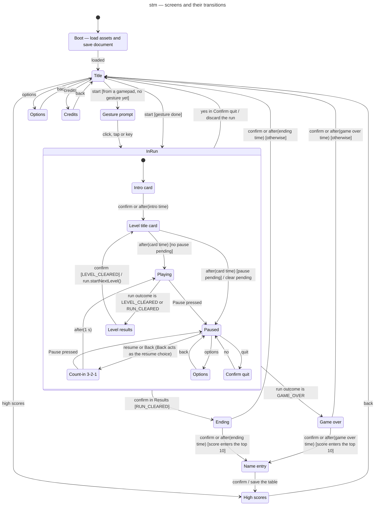

# State machine diagram — meta — screens and their transitions (1.0)

> **Source specs**: [Game Design Document](../../../design/game-design-document.md) v0.4 §3.4,
> §4.2, §9.1, §9.3
> **Related ADRs**: ADR-0006 (save document), ADR-0009 (gestures, automatic pause), ADR-0010
> (one run, one bus)
> **Realizes**: UC1–UC7 of [01-use-case](../system/01-use-case.md) at the screen level; the
> `SceneMachine` component of [03-component](../system/03-component.md)

## Context

Every screen of the game and what moves between them — the `SceneMachine`. It owns the active
`Run` while one exists, reads its outcome after each step, and is the only place where the
pause is decided (02-sequence-fixed-step-tick). Notation: `trigger [guard] / effect`.

## Diagram

## Notes

- **`InRun` entry creates the run, exit releases it** (`entry / new Run`, `exit / release Run`): a
  new run never inherits listeners of the previous one (ADR-0010).
- **Edges leaving `InRun` start from one substate**: Mermaid draws them from the composite
  boundary, so the label names the substate (`yes in Confirm quit`, `confirm in Results`); `Game
  over` is reached from `Playing`, when the run's outcome becomes `GAME_OVER` at the end of the
  death sequence (05-state-player).
- **Pause rules** (GDD v0.4 §9.1, ADR-0009):
  - in `Playing`, only `Pause` enters `Paused`, before the run steps; `Back` is ignored in play, so
    the gamepad `B` (bomb and back) never pauses. The keyboard `Esc` sets both `Pause` and `Back`:
    it pauses in play and resumes from the pause;
  - in `Paused`, `Pause` does nothing — automatic triggers can only enter the pause — and `Back`
    resumes like the menu choice;
  - in `Count-in`, `Pause` returns to `Paused`, so an automatic trigger never lets the game resume
    unfocused;
  - in a card or the results, `Pause` (player or automatic) sets a **pending pause** flag, applied
    when play starts and cleared when leaving `InRun`;
  - every other scene ignores `Pause`.
- **The time scale** returned to the loop is 1 in every scene except `Playing` (ADR-0010).
- **Options are two states sharing one screen implementation**, so `back` returns to the right
  parent without a history pseudostate.
- **Gesture prompt** exists only for a start from a gamepad before any click, tap or key press;
  the audio unlock itself happens in the input adapter's handler (ADR-0009).
- **Name entry** follows both Ending and Game over when the score qualifies (GDD v0.2 §9.1); a run
  quit from the pause never reaches it. High scores then show the new entry highlighted (UC3).
