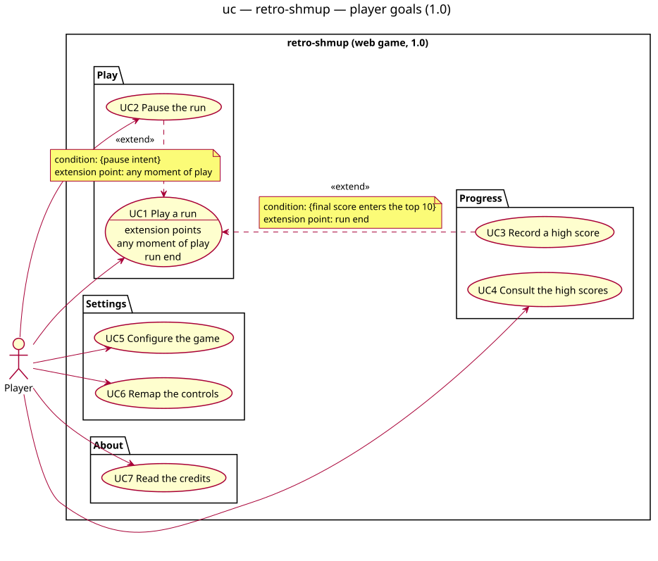

# Use-case diagram — system — player goals (1.0)

> **Source specs**: [Game Design Document](../../../design/game-design-document.md) v0.2 — §2, §3.4,
> §4, §6–§9
> **Related ADRs**: ADR-0002 (timestep), ADR-0003 (architecture), ADR-0005 (credits),
> ADR-0006 (player data)
> **Realized by**: the sequence, class and state diagrams of `gameplay/` and `meta/`, stitched
> by the [traceability matrix](../../traceability-matrix.md)

## Context

Who interacts with the game, and to achieve what. One primary actor, the **Player**, whatever
the input device (keyboard, touch, gamepad, mouse): devices are not actors, they produce intents
(GDD §4.2). There is no secondary actor in 1.0 — no backend, no account, no network (ADR-0006).
The browser is the environment, not a stakeholder: its events (tab hidden, focus lost, gamepad
disconnected) appear as **extensions** of UC1, never as use cases.

Use cases are grouped by **domain**, never by implementing component (the component split lives
in the component diagram). The in-run verbs — move, shoot, catch a pickup, drop a bomb — are
**steps** of UC1, not goals: the player does not want to "shoot", they want to finish a run with
the best score (Cockburn, goal levels). Out of 1.0 (GDD §11): boss practice, level select,
online leaderboard, the rescue mechanic.

## Diagram

Source: [`01-use-case.puml`](01-use-case.puml) — regenerate the SVG with
`plantuml -tsvg docs/architecture/diagrams/system/01-use-case.puml`.

## Use-case specifications

Durations and quantities marked *(initial)* in the GDD are referenced, not restated, unless a
step depends on them.

### UC1 — Play a run

- **Primary actor**: Player. **Level**: user goal.
- **Stakeholders & interests**: Player — a fair, readable challenge and a score that reflects
  skill. Owner — a run is a pure function of (level scripts, input stream, seed) (ADR-0002).
- **Preconditions**: the title screen is displayed with the controls of the active device
  (GDD §7.3); assets are loaded.
- **Minimal guarantee**: the stored options and top 10 are never corrupted; no run state is
  persisted (closing the tab ends the run without trace).
- **Success guarantee**: the run ends on the Ending screen with its final score, then the
  run-end comparison (step 11) is made.
- **Extension points**: *any moment of play* (steps 4–8); *run end* (step 11).
- **Main success scenario**:
  1. Player presses Start on the title screen; the gesture unlocks audio (GDD §4.2, §9.5).
  2. The game shows the intro card (GDD §3.4).
  3. The game initializes the run: 3 lives, Spread at power 1, 2 bombs, no shield, chain ×1,
     score 0 (GDD §4).
  4. The game shows the level title card (GDD §3.4).
  5. Player pilots the ship, shoots and dodges while the level script spawns waves (GDD §7).
  6. Player catches pickups dropped by destroyed enemies; each effect applies at once (GDD §4.6).
  7. After the scripted waves the game announces the boss (GDD §6).
  8. Player destroys the boss through its phases (GDD §6).
  9. The game shows the level results tally (GDD §8).
  10. Steps 4–9 repeat for levels 2 and 3. Lives, weapon colour, power level, bombs, shield
      charge, chain and score carry over between levels.
  11. After level 3 the game shows the Ending; the game compares the final score with the local
      top 10 (*run end*).
  12. The game returns to the title screen.
- **Extensions**:
  - 1a. Start comes from a gamepad before any click, tap or key press: the game asks for one,
    then continues at step 2 (browsers unlock audio and fullscreen only on such a gesture).
  - 5a. Player drops a bomb:
    - 5a1. Stock > 0: enemy bullets are cancelled, every enemy including the boss takes heavy
      damage, 1 s of invulnerability, the no-bomb bonus is lost (GDD §4.5).
    - 5a2. Stock = 0: nothing happens.
  - 5b. Player is hit while holding a shield charge: the charge absorbs the hit, short
    invulnerability, play continues (GDD §4.4).
  - 5c. Player is hit without a shield charge: one life is lost, chain resets to ×1, bombs reset
    to 2, power drops by one level and that level is released as a pickup — at power 1 nothing
    is released — then the ship respawns with temporary invulnerability (GDD §4.4).
    - 5c1. No life remains: the game shows Game over; continue at step 11 (comparison), then 12.
  - 6a. A pickup type appears for the first time in this run: a one-second label names it
    (GDD §7.3).
  - 6b. The pickup's effect cannot apply (power 5, 5 bombs, shield already held, 9 lives): it
    grants 1 000 points instead; a P of the other colour still switches the weapon (GDD §4.6).
  - 6c. Player lets a pickup leave the screen: it is lost.
  - 8a. The boss timer expires: the boss flees, no boss bonus, continue at step 9 (GDD §6).
  - 11a. The final score enters the top 10: UC3 runs at *run end*, then step 12.
  - *a. At any moment of play (steps 4–8), Player pauses: UC2.
  - *b. At any moment of play, the tab is hidden, the window loses focus, or the gamepad in use
    disconnects: the game enters the paused state of UC2 (step 2) and shows the pause menu; it
    never resumes on its own — Player continues at UC2 step 3 (GDD §9.1).
- **Postcondition**: the final score is known; it is persisted only through UC3.
- **Relationships**: extended by UC2 (*any moment of play*) and UC3 (*run end*).

### UC2 — Pause the run

- **Primary actor**: Player. **Level**: subfunction, extends UC1.
- **Preconditions**: a run is in play (UC1 steps 4–8).
- **Success guarantee**: while paused the simulation is frozen — no tick, no timer, no random
  draw; on resume no paused time reaches the simulation — the loop keeps running and the paused
  scene takes every step (ADR-0002, GDD §9.1).
- **Main success scenario**:
  1. Player triggers the `pause` intent.
  2. The game freezes the simulation, ducks the music, silences the SFX and shows the pause menu
     (resume, options, quit).
  3. Player chooses resume.
  4. The game shows a 1 s 3-2-1 count-in, the simulation still frozen, the music returning.
  5. The simulation resumes where it stopped.
- **Extensions**:
  - 3a. Player chooses options: UC5, then back to step 2.
  - 3b. Player chooses quit; the game asks for confirmation, default "No":
    - 3b1. Player confirms: the run is discarded, no name entry, the game shows the title screen.
    - 3b2. Player declines: back to step 2.

### UC3 — Record a high score

- **Primary actor**: Player. **Level**: subfunction, extends UC1.
- **Preconditions**: a run has ended on Ending or Game over, and its final score enters the top
  10 (strictly greater than the 10th entry, or fewer than 10 entries are stored).
- **Success guarantee**: the entry (initials, score, level reached, date) is stored at its rank;
  the high-score table shows it highlighted.
- **Minimal guarantee**: if storage fails, the table still shows the entry for the session;
  nothing crashes (ADR-0006).
- **Main success scenario**:
  1. The game shows the arcade name entry with the score, initials preset to `AAA`.
  2. Player enters three characters (A–Z, 0–9, space, `.`) and confirms; there is no timer.
  3. The game inserts the entry at its rank — after earlier entries of equal score — keeps the 10
     best, and saves the table.
  4. The game shows the high scores with the new entry highlighted.
  5. Player returns to the title screen.
- **Extensions**:
  - 2a. On touch: the characters are picked from an on-screen letter grid.
  - 3a. Storage is unavailable or full: the save is skipped silently; the in-memory table is
    shown for the session.

### UC4 — Consult the high scores

- **Primary actor**: Player. **Level**: user goal.
- **Main success scenario**:
  1. Player opens the high scores from the title screen.
  2. The game shows the local top 10: rank, initials, score, level reached.
  3. Player returns to the title screen.
- **Extensions**:
  - 2a. Fewer than 10 entries exist: the empty rows show dashes.
  - 2b. The stored document is unreadable: an empty table is shown; the document is not
    rewritten until the next score or option change.
  - 2c. The stored document has a higher, unknown version (newer data read by an older build):
    an empty table is shown and nothing is written for the rest of the session (ADR-0006).

### UC5 — Configure the game

- **Primary actor**: Player. **Level**: user goal.
- **Preconditions**: the title screen or the pause menu is displayed.
- **Success guarantee**: every change applies immediately and is saved (ADR-0006).
- **Main success scenario**:
  1. Player opens the options.
  2. Player adjusts any option of GDD §9.3: music and SFX volumes, language, fullscreen, the
     on/off switch of each visual effect.
  3. The game applies each change at once and saves the options.
  4. Player returns to the previous screen.
- **Extensions**:
  - 1a. First launch with `prefers-reduced-motion`: shake, flashes, hit-stop and slow motion are
    preset to off (GDD §9.3).
  - 2a. Player wants to change the controls: see UC6.
  - 3a. Fullscreen is enabled outside a click, tap or key press: the preference is saved and
    applied on the next Start gesture (GDD §9.3).
  - 3b. Storage is unavailable: changes apply for the session only.

### UC6 — Remap the controls

- **Primary actor**: Player. **Level**: user goal.
- **Preconditions**: the options are open on a keyboard or gamepad device.
- **Success guarantee**: every remappable intent stays bound; the bindings are saved (GDD §4.2).
- **Main success scenario**:
  1. The game lists the remappable intents (`move` ×4, `fire`, `bomb`, `pause`) with their
     primary and secondary bindings for the active device; `confirm` and `back` are shown as
     fixed.
  2. Player selects one slot of one intent; the game waits for the next key or button.
  3. Player presses a key or button; the game binds the physical key to that slot and saves.
- **Extensions**:
  - 1a. The active device is touch or mouse: nothing is remappable; the section is hidden.
  - 2a. Player chooses "restore defaults" and confirms: every binding of the device is reset.
  - 3a. The key is already bound to another slot: the two slots swap their keys.
  - 3b. Player presses `Esc` (keyboard) or waits 5 s (gamepad): the slot is unchanged.

### UC7 — Read the credits

- **Primary actor**: Player. **Level**: user goal.
- **Stakeholders & interests**: asset licensors — attribution required by CC BY (ADR-0005).
- **Main success scenario**:
  1. Player opens the credits from the title screen.
  2. The game shows the credits, mirroring `CREDITS.md` (ADR-0005).
  3. Player returns to the title screen.

## Notes

- **No use case for move / shoot / bomb / catch**: they are steps and extensions of UC1; their
  behaviour is specified by the sequence and state diagrams of `gameplay/`. Promoting them would
  describe the controller, not the player's goals.
- **UC6 is a goal, not an extension of UC5**: opening the controls section is navigation, which
  is not modelled as a relationship. UC5 2a only points to it.
- **Environment events are extensions, not use cases** (UC1 \*b): UML 2.5 use cases are
  actor-initiated.
- **"Learn the controls" is not a use case**: the title screen shows them (UC1 precondition).
  Closing the tab and a fullscreen hotkey are not modelled either.
- **Known limitation**: "level reached" is 3 for both a death in level 3 and a full clear; the
  Ending is not distinguished in the table. Accepted for 1.0.
- **GDD v0.2**: the rules this study surfaced — physical-key bindings with two slots, pause
  triggers and count-in, quit confirmation, Ending → name entry, per-effect switches, pickup cap,
  start weapon, no release at power 1, bombs hitting the boss, the activation gesture — are in
  the GDD and its Decision record.
