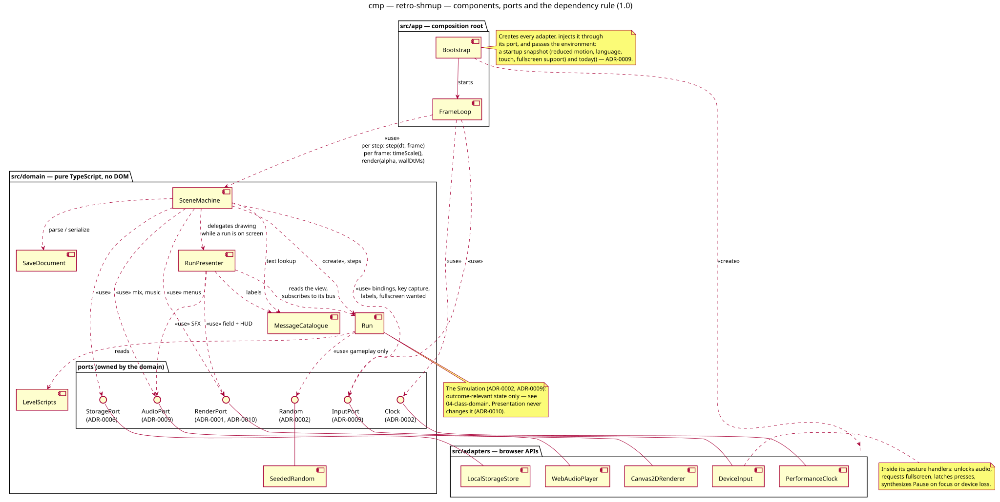

# Component diagram — system — components, ports and the dependency rule (1.0)

> **Source specs**: [Game Design Document](../../../design/game-design-document.md) v0.3 §4.2,
> §9, §13
> **Related ADRs**: ADR-0001 (RenderPort), ADR-0002 (Clock, Random, loop), ADR-0003 (layout,
> ports, dependency rule), ADR-0006 (StoragePort), ADR-0009 (input and audio contracts),
> ADR-0010 (presentation outside the outcome)
> **Realizes**: the structure behind every use case of [01-use-case](01-use-case.md)

## Context

How the bundle is structured, and which way dependencies point. Three directories (ADR-0003):
`src/app` wires, `src/domain` decides and presents, `src/adapters` touches the browser. The ports
are **owned by the domain**; adapters implement them, so every dependency between domain and
browser points inward. Inside the domain, the outcome of a run (`Run`) is separated from its
presentation (`RunPresenter`, ADR-0010). Classes inside the run are in
[04-class-domain](../gameplay/04-class-domain.md); behaviour over time is in the sequence
diagrams.

## Diagram

Source: [`03-component.puml`](03-component.puml) — regenerate the SVG with
`plantuml -tsvg docs/architecture/diagrams/system/03-component.puml`.

## Components

| Component | Directory | Responsibility | Depends on |
|---|---|---|---|
| Bootstrap | `src/app` | Creates the adapters, injects them through the ports with the startup snapshot (ADR-0009), starts the loop | everything (composition root) |
| FrameLoop | `src/app` | `requestAnimationFrame` driver: wall time from `Clock`, multiplied by `SceneMachine.timeScale()` (ADR-0010), fed to the fixed-step accumulator (ADR-0002); per step reads one `IntentFrame` and calls `step`; per frame calls `render(alpha, wallDtMs)` with the unscaled wall time | SceneMachine, Clock, InputPort |
| SceneMachine | `src/domain` | The screens of GDD §9.1 and their transitions; creates and steps the `Run`; draws menus; drives the music and the pause mix; loads and saves through `StoragePort` | Run, RunPresenter, SaveDocument, MessageCatalogue, ports |
| Run | `src/domain` | The simulation of one run — outcome-relevant state only: entities, patterns, pools, event bus, scoring, collisions | LevelScripts, Random |
| RunPresenter | `src/domain` | Draws the play field and the HUD from the run's interpolated view; owns particles and game-feel effects (unseeded randomness, timers in wall-clock ms); provides the time scale of hit-stop and slow motion; first-time pickup labels, score pop-ups; maps events to SFX (ADR-0010) | Run (read only), MessageCatalogue, RenderPort, AudioPort |
| LevelScripts | `src/domain` | The three typed, declarative level scripts (GDD §7.1) and the archetype data (GDD §5) | — |
| SaveDocument | `src/domain` | Schema, parsing (never throws) and serialization of the save document (ADR-0006) | — |
| MessageCatalogue | `src/domain` | EN / FR strings by key (GDD §9.6) | — |
| SeededRandom | `src/domain` | The deterministic PRNG behind `Random`, used by gameplay only | — |
| Canvas2DRenderer | `src/adapters` | Implements `RenderPort`: 240 × 320 field plus HUD bands, integer scaling (ADR-0001, ADR-0010) | Canvas 2D |
| WebAudioPlayer | `src/adapters` | Implements `AudioPort`: SFX, music, volumes, pause mix; suspends while the tab is hidden (ADR-0009) | Web Audio |
| DeviceInput | `src/adapters` | Implements `InputPort`: keyboard (physical keys, two slots), touch, mouse, gamepad → one reusable `IntentFrame`; latches presses; synthesizes `Pause` on focus, tab or gamepad loss; inside its gesture handlers unlocks audio and requests fullscreen (ADR-0009) | DOM events, Gamepad API, Page Visibility, Fullscreen API |
| LocalStorageStore | `src/adapters` | Implements `StoragePort` on `localStorage`, reports unavailability (ADR-0006) | Web Storage |
| PerformanceClock | `src/adapters` | Implements `Clock` with `performance.now()` | High Resolution Time |

## Notes

- **The dependency rule is visible**: no arrow goes from `src/domain` to `src/adapters`; adapters
  attach to interfaces inside the domain. A lint boundary and the domain `tsconfig` without
  `DOM` enforce it (ADR-0003).
- **Pause has no extra port and needs no clock reset**: the triggers arrive as `Pause` in
  `pressed`; the scene machine handles it **before** stepping the run, so the step that would
  have advanced is not taken. The loop never stops; while paused, the steps go to the Paused
  scene, which does not advance the run. On return from a hidden tab the ADR-0002 clamp bounds
  the catch-up, and those steps also go to the Paused scene.
- **Presentation is outcome-neutral** (ADR-0010): `RunPresenter` only reads the run and listens
  to its bus; it has its own randomness; hit-stop and slow motion are a time scale in the loop.
- **`Random` is a port with a domain implementation**: the seed is injected, so the headless
  simulation tests (ADR-0003) and future replays control it.
- **Browser-gesture work stays in the adapter** (ADR-0009): audio unlock and fullscreen requests
  happen inside the input handlers, where browsers allow them; the domain only holds the
  "fullscreen wanted" preference.
